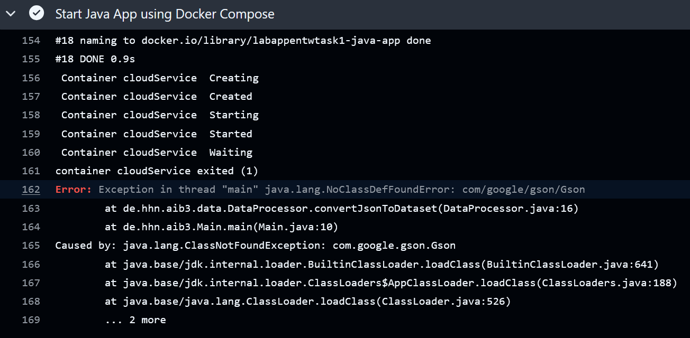
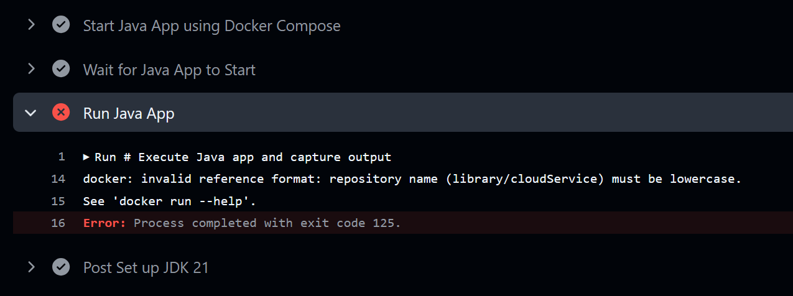

# HHN - AIB3 - Labor für App-Entwicklung - Aufgabe 1
<a href=https://gist.github.com/MB175/42d2f3aae389210fcccf1b106509860e>Room for discussions</a>
 <a href=https://hub.docker.com/r/mrksdh/assessment>Docker image</a>
## Aufgabenstellung
Entwicklung eines Systems zur Berechnung der Gesamtnutzungszeit von Cloud-Kunden
 Containerisierung der Anwendung und Bereitstellung einer Docker-Compose Datei
 Erstellen einer GithubAction welche das System gegen das assessment image prüft
 Docker Image: mrksdh/assessment
 (Port 8080)
### Anwendung
   * Liest Rohdaten über eine Webschnittstelle aus
   * Aggregiert die Informationen
   * Sendet das Ergebnis an ein Referenzsystem
## ToDo's
1. Error: Exception in thread "main" java.lang.NoClassDefFoundError: com/google/gson/Gson
 
 gradle build may not work properly or needs more time
 Use shadow plugin to put the external libraries (gson) into the .jar file
2. docker: invalid reference format: repository name (library/cloudService) must be lowercase.
 See 'docker run --help'.
 Error: Process completed with exit code 125.
 